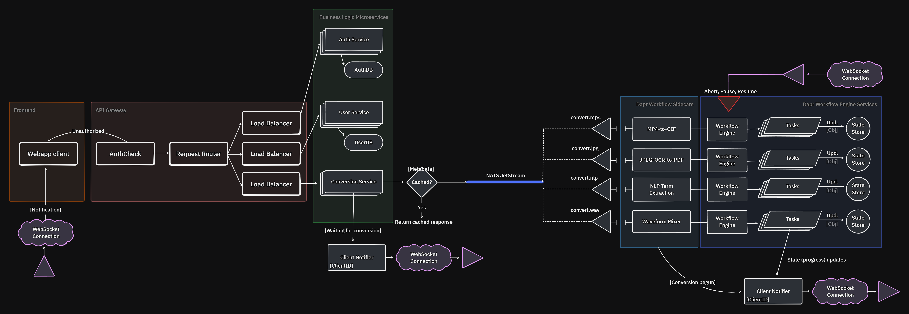

# entask
an online informational systems projecting university project, depicting a microservice-oriented, scalable, durable and consistent content conversion/transcoding platform. the project takes advantages of durable execution patterns (using the Dapr Workflow Engine library), Publisher/Subscriber state models via Redis Streams, message brokerage via NATS JetStream, API Gateway for auth-checks, request routing, and per-service load balancing, as well as a Service Discovery pattern (implemented using a shared Redis cache registry). The frontend is built in Angular, version 19.

## The schema

a very rough-looking schema, will evolve as the project itself evolves. currently, it only serves a development guidance, so i dont steer off into the unknown.

### <<under_construction>>
### TODO:
- ~~Refactor backend from a monolith into microservices~~
- Refactor frontend using the microfrontend pattern
- Implement a generic (parametrized) load balancer instancing service upon instantiating the 0th (1st) service - registry lookup