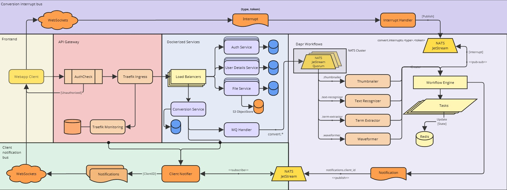
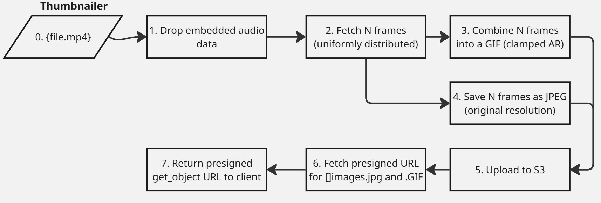
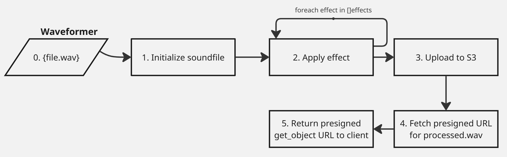
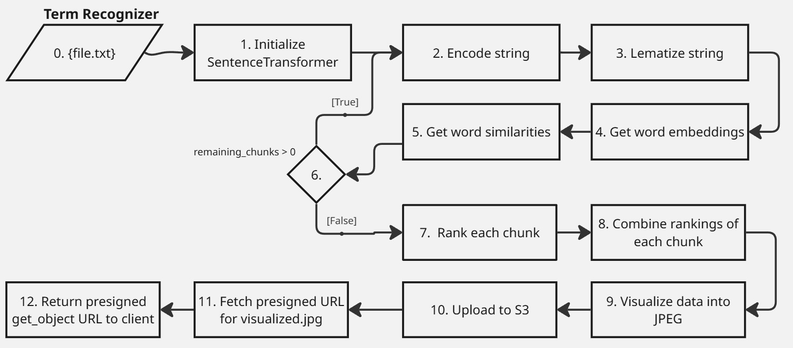
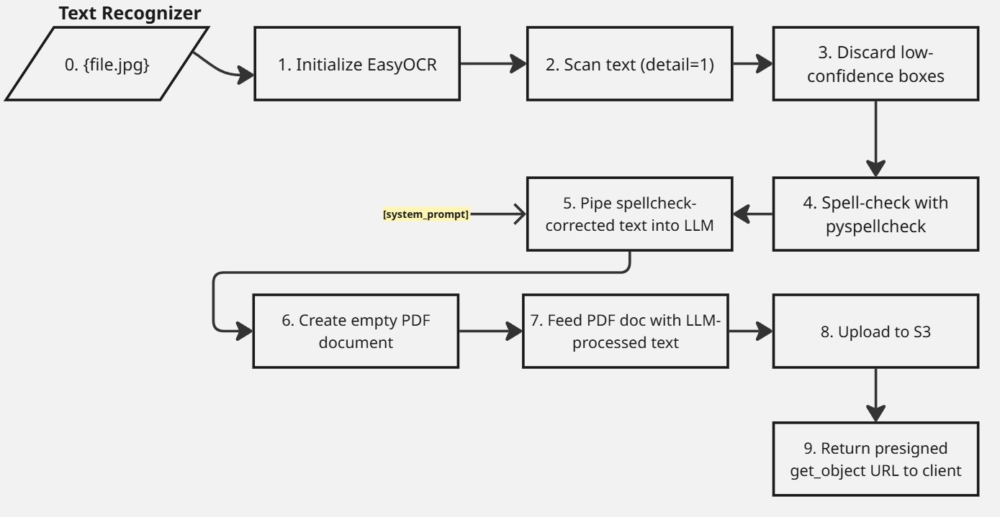

# entask
a university project in online informational systems design. it models a microservice-oriented platform for scalable, durable, and consistent content conversion/transcoding. the system applies durable execution (dapr workflow engine), pub/sub state models (redis streams), message brokerage (nats jetstream), and an api gateway (traefik) for auth checks, request routing, and per-service load balancing, with the frontend is built in angular v19.

## schema

a very rough-looking schema, will evolve as the project itself evolves. currently, it only serves a development guidance, so i dont steer off into the unknown.

## usage
deployment is supported via **docker swarm** (*todo hihi*) or **docker compose**.

prerequisites:
  - docker

installation:
  1. clone the repo (`git clone https://github.com/komadiina/entask.git`)
  2. initialize `.env` with all required values (user/password credentials, hosts, ports)
  3. modify config files in `/core/*` according to set envvars (still havent migrated them into a generation script)
  4. run with `docker compose up` (use `-d` for detached)
  5. stop with `docker compose down -v --remove-orphans`
  - if any `package.json` or `requirements.txt` changes haven't reflected, pass the `--force-recreate` flag into `docker compose up`

### envfile

| envvar                    |  description                                                                |
|---------------------------|-----------------------------------------------------------------------------|
| `PGADMIN_EMAIL`           | use this email with `POSTGRES_PASSWORD` to log into pgAdmin console         |
| `FRONTEND_HOST`           | hardcoded, used for client-side redirects (`0.0.0.0` does not work here)    |
| `CLIENT_SECRET_FILE`      | your Google API Client secrets file                                         |
| `GOOGLE_OAUTH_CLIENT_ID`  | extracted from the secret file or via the Google Cloud console              |
| `GOOGLE_KEYS_URL`         | public Google endpoint for fetching public keys (if `provider == 'google'`) |
| `...`                     | others are pretty self-explanatory                                          |

### default hosts/listens

take note that some require authenticated URLs (`user:pass@host:port`):

| docker-service                | listen                            |
|-------------------------|---------------------------------------|
| **MinIO**              | `minio:9000`                         |
| **NATS**               | `0.0.0.0:{4222, 6222, 8222}`         |
| **PostgreSQL**         | `postgres:5432`                      |
| **pgBouncer**          | `pgbouncer:6432`                     |
| **Redis**              | `redis:6379`                         |
| **Traefik**            | `0.0.0.0:{80, 443, 8080}`            |
| **angular client**      | `frontend:4200`                      |
| **auth-service**       | `auth-service:5201`                  |
| **user-details-service** | `user-details-service:5202`        |
| **file-service**       | `file-service:5204`                  |
| **conversion-service** | `conversion-service:5205`            |
| **notifier-service**   | `notifier-service:5206`              |
| **thumbnailer-converter** | `thumbnailer-converter:7401`      |
| **ws-proxy**            | `ws-proxy:9202`                     |

## components
review [TODO](./todo.md) for roadmap, issues & etc

## converters
**all** converters use `minio` and `httpx` for file-based communication (no ftp yet)

___

thumbnailer uses:
- `ffmpeg` & `imageio`
- `moviepy`

___

waveformer uses:
- `pedalboard`

___

term-extractor uses:
- `sentence-transfomers`
- `spacy`

___

text-recognizer uses:
- `easyocr`
- `pyspellchecker`
- `openai`
- `fpdf2`
