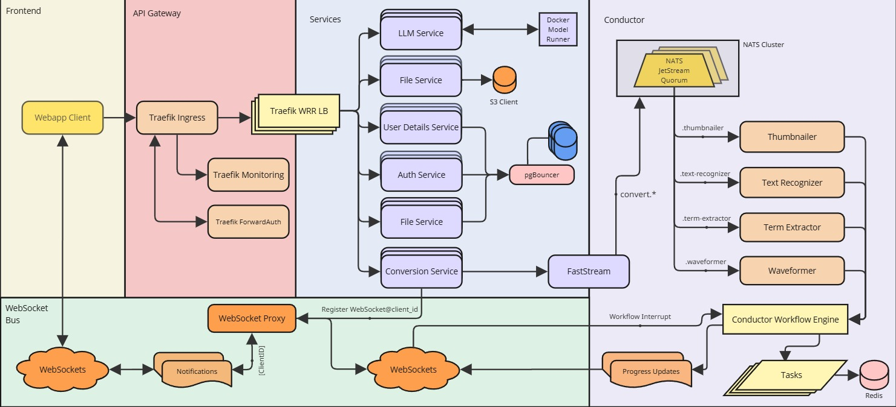

# entask
an online informational systems' design university project, depicting a microservice-oriented, scalable, durable and consistent content conversion/transcoding platform. the project takes advantages of durable execution patterns (using the Dapr Workflow Engine library), Publisher/Subscriber state models via Redis Streams, message brokerage via NATS JetStream, API Gateway (Traefik) for auth-checks, request routing, and per-service load balancing, as well as a Service Discovery pattern (implemented using a shared Redis cache registry), deployed via Docker Swarm or Docker Compose. frontend is built in Angular, version 19.

## schema

a very rough-looking schema, will evolve as the project itself evolves. currently, it only serves a development guidance, so i dont steer off into the unknown.

## components
review [TODO](./todo.md) for roadmap, issues & etc
